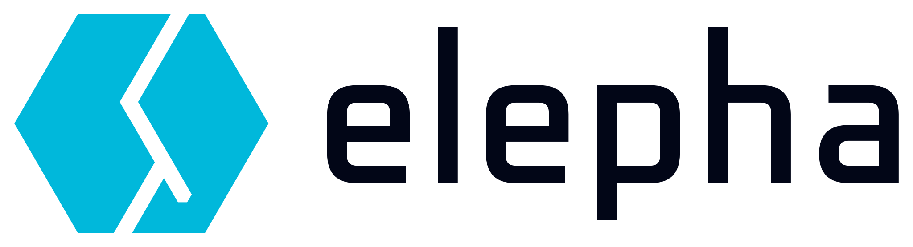

<p align="center">
  <picture>
    <source media="(prefers-color-scheme: dark)" srcset="docs/assets/elepha-light.svg" width="340" alt="elepha">
    
  </picture>
</p>

<p align="center"><b>Switch tools, keep the context.</b></p>
<p align="center">Turn local AI coding transcripts into searchable memory you can recall in any supported tool.</p>

<p align="center">
  <a href="#supported-tools-and-platforms"></a>
  <br>
  <a href="https://www.npmjs.com/package/elepha"></a>
  <a href="https://github.com/elepha-app/elepha/actions/workflows/ci.yml"></a>
  <a href="#supported-tools-and-platforms"></a>
  <a href="LICENSE.md"></a>
</p>

The elepha demo video below shows Codex stopping mid-task, then Claude Code resuming that
same session and explaining why an earlier approach was rejected, from a conversation it
never had.

[elepha demo](https://github.com/user-attachments/assets/478a14aa-acb8-4a51-99d6-e809d0473280)

## About elepha

**elepha** is a local memory layer over the session transcripts that AI coding tools
already write to disk. It turns that existing history into searchable memory you can
recall inside the chat you are already using.

- **Not a wrapper** — Keep using your tool directly; **elepha** never sits in front of it.
- **Repository-clean** — Adds nothing to your repositories, and never modifies the original transcripts.
- **Automatic capture** — Sessions are recorded as you work; nothing to save, tag, or write up.
- **You choose what it remembers** — Approve whole workspace folders or individual projects; their existing transcripts become searchable straight away.
- **More than the diff** — git shows what changed; **elepha** keeps the reasoning behind it: the approaches you rejected, the constraints, the thinking you left unfinished.

## How it works

1. **Reads local transcripts in the background.** It watches the session files that supported tools already write, limited to projects and folders you approve.
2. **Builds one searchable local memory.** It organizes eligible sessions in one local database.
3. **Recalls inside your current chat.** Search with `elepha:query`, pick a result with `elepha:select:<n>`, or go straight to the latest with `elepha:last`.

<!-- In-chat demo placeholder: show elepha:list and elepha:last recalling a real session. -->

## In-AI-chat commands

| Command                            | What it does                                                   |
|------------------------------------|----------------------------------------------------------------|
| `elepha:last`                      | Inject the most recent session and continue where you stopped. |
| `elepha:list`                      | List the five most recent sessions, numbered.                  |
| `elepha:list:<n>`                  | List the last `n`, up to 100.                                  |
| `elepha:query <search terms>`      | Search every approved project.                                 |
| `elepha:query:here <search terms>` | Search the current project only.                               |
| `elepha:select:<n>`                | Inject session `n` from the last list or query.                |

Full list: [docs/commands-in-ai-chat.md](docs/commands-in-ai-chat.md).

## Supported tools and platforms

**elepha** supports **Claude Code** and **Codex**, each in both the desktop app and the
CLI, with memory shared across all of them. Support for more transcript-writing AI
coding tools is planned.

It runs on **macOS**, **Linux**, and **Windows through WSL**, with **Node.js 22 or
newer**. Native Windows is not supported.

The original transcripts are never modified, so memory can always be rebuilt. That
matters while **elepha** is still pre-1.0: its storage schema and command surface can
change between releases.

## Privacy and consent

**elepha** runs entirely on your machine: capture, storage, search, and recall are local,
with no hosted memory service. The one exception is explicit; if you configure an
external synthesis provider, the turns sent for synthesis are handled under that
provider's data policy.

- **Consent-gated** — you choose which projects or workspace folders **elepha** may capture.
- **Transcript-safe** — the original session files are never modified.
- **One local database** — memory lives at `~/.elepha/elepha.db` and can be rebuilt from retained transcripts; back it up to keep consent and deletion history.

## Get started

```console
npm install -g elepha
elepha install
elepha init
```

Codex needs a one-time approval of **elepha's** hooks through `/hooks`. Then open a
supported tool and type `elepha:last`.

Full walkthrough: [getting-started guide](docs/getting-started.md).

## Documentation

- [Getting started](docs/getting-started.md)
- [In-AI-chat command index](docs/commands-in-ai-chat.md)
- [CLI command index](docs/commands-cli.md)
- [Choosing what elepha may remember](docs/consent.md)
- [Controlling capture](docs/capture.md)
- [Configuration](docs/configuration.md)
- [Protecting and moving memory](docs/storage.md)
- [Deleting memory](docs/purge.md)
- [Updating and maintenance](docs/maintenance.md)
- [Troubleshooting](docs/troubleshooting.md)

## Possible scenarios

**Your assistant runs out of tokens mid-task.** You are deep in a problem when one
assistant hits its usage limit before it can even prepare a handoff. Open another
supported tool, type `elepha:last`, and carry on. Claude Code runs dry, Codex picks it
up, or the other way around.

**You want a second opinion.** Pull the same session into another tool with
`elepha:last` and ask it to review. To reach further back, search in plain language:
`elepha:query the N+1 we fixed in the orders query`, then `elepha:select:<n>`.

## License and links

**elepha** is open-source software licensed under the [Mozilla Public License 2.0 (MPL-2.0)](LICENSE.md).

- [Security policy](SECURITY.md)
- [Contributing guide](CONTRIBUTING.md)
